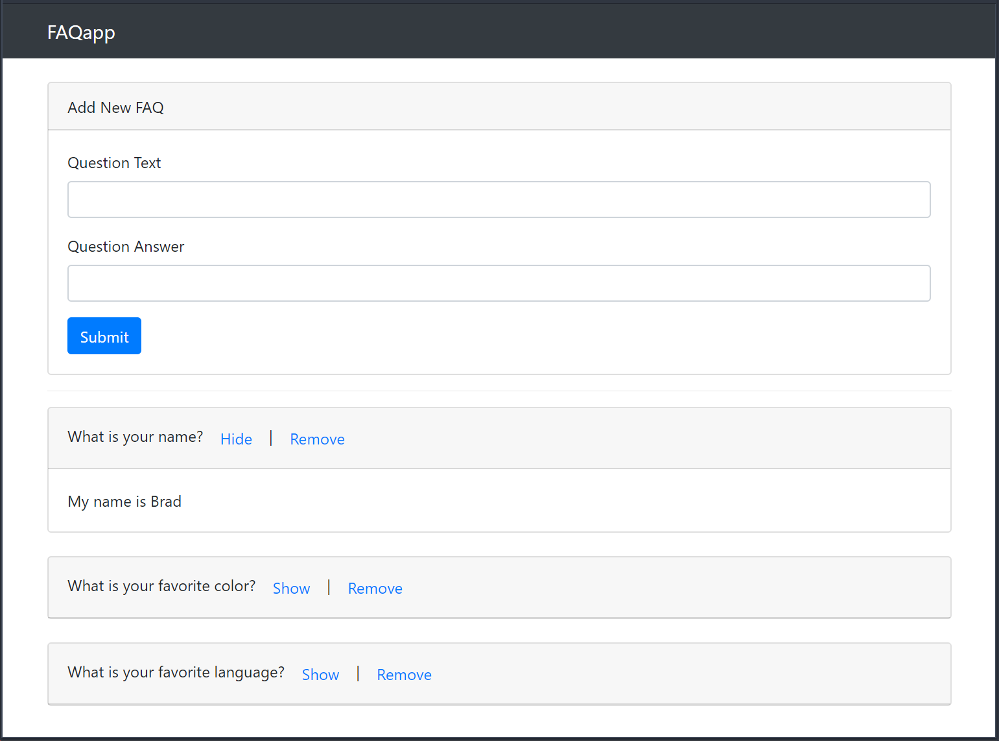

# Angular LocalStorage FAQ App
This project is the result of my code-along to the FAQ App Project in [Angular 4 Front to Back](https://www.udemy.com/angular-4-front-to-back/) by *Brad Traversy*.  He is an excellent teacher, and I highly recommend taking his course to learn Angular!

     
    <a href="https://localstoragefaq.firebaseapp.com/" target="_blank">Angular LocalStorage FAQ App</a>

## Versions
* [Angular CLI](https://github.com/angular/angular-cli) v1.6.3
* Angular v5.1.3

## Installation
1. Clone this repo `git clone https://github.com/Stanza987/angular-localStorage-faq.git`
1. `cd` into the folder of the cloned repo
1. Run `yarn install` to install dependencies
1. Run `ng serve`, and navigate to `http://localhost:4200/`
